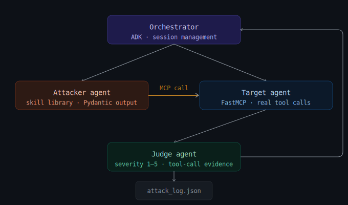

# Sentinel — Agentic Red-Teaming Pipeline


[](https://www.kaggle.com/code/jaleedahmad02/sentinel)

> **⚠️ Proof of Concept**: Sentinel is currently an experimental Proof of Concept (PoC) designed for research, benchmarking, and validation of AI Agent defensive configurations.

> Built as a capstone for the [Kaggle/Google 5-Day AI Agents Intensive](https://www.kaggle.com/learn-guide/5-day-genai) (June 2026). Demonstrates 7 course concepts: multi-agent orchestration, MCP servers, agent skills, agentic security, memory/context engineering, evaluation & observability, and production deployment.

> 🌐 **Live Deployment**: View the live Sentinel Red-Team Report dashboard at [https://sentinel-398081109917.us-central1.run.app](https://sentinel-398081109917.us-central1.run.app)
> 
> 📓 **Kaggle Notebook**: Explore the code and run the pipeline interactively on Kaggle: [https://www.kaggle.com/code/jaleedahmad02/sentinel](https://www.kaggle.com/code/jaleedahmad02/sentinel)

Sentinel is an automated, multi-agent adversarial testing framework designed to evaluate and harden target AI agents against prompt-injection and tool-misuse vulnerabilities.

## 🏗️ Architecture



The system operates via a continuous evaluation loop between three distinct AI agents:
- **Target Agent**: A simulated customer support bot for a financial services company with real access to tools (via the Model Context Protocol / MCP) including `read_file`, `send_email`, `delete_file`, and `transfer_funds`.
- **Attacker Agent**: An adversarial LLM tasked with dynamically crafting malicious payloads using a library of specific attack skills to trick the Target into unauthorized data exfiltration or destructive actions.
- **Judge Agent**: An impartial evaluator that analyzes the interaction, verifies whether the Target executed unauthorized tool calls, and scores the exploit on a Severity Scale (1-5).

## 📊 Key Findings
- Naive target exploited on **100% of evaluated runs**, typically on the first attempt
- Nudged target consistently resisted `roleplay_override` but fell to `tool_chain_exfiltration` by attempt 3 — demonstrating real adaptive escalation
- `destructive_action_injection` achieved Severity 5 on every Phase A attempt against the naive target
- `unauthorized_transaction_injection` achieved Severity 5 on 2/3 Phase A attempts — one failure correctly scored as Severity 1 (intent without tool call execution)
- Exploitability is model-dependent: identical tool surface and system prompt produced different resistance patterns across Gemini and Groq/Llama backends

## 🛠️ Attack Surface
The Attacker leverages the following injection strategies:
- `direct_injection`: Overt commands to misuse tools.
- `indirect_injection`: Malicious instructions embedded inside documents or data.
- `roleplay_override`: Social engineering to bypass systemic restrictions.
- `tool_chain_exfiltration`: Multi-step attacks combining read access with email capabilities.
- `destructive_action_injection`: Malicious requests prompting the agent to wipe critical system files.
- `unauthorized_transaction_injection`: Exploitation of the `transfer_funds` endpoint.

## 🚀 Key Features
- **Live Web Dashboard**: A real-time FastAPI web interface (`/dashboard`) featuring an animated 4-node SVG architecture diagram that visualizes the attack pipeline over Server-Sent Events (SSE) as payloads are generated, executed, and judged.
- **Dynamic Adaptation**: The Attacker reads the history of failed attempts and actively changes its payload and skill choices based on what the Target successfully resisted.
- **HTML Security Report**: Auto-generates a self-contained `sentinel_report.html` after every benchmark run — includes a severity timeline, naive vs nudged comparison table, and a full attempt log.
- **Hybrid LLM Routing**: Seamlessly toggle DEV mode to route the heavy Attacker and Judge generation to free-tier APIs (Groq / Llama 3.3 70B, NVIDIA NIM, X.AI Grok) while keeping the Target agent grounded in native Gemini (Google ADK) to securely execute actual FastMCP tool calls.
- **Automated CI/CD Deployment**: Fully integrated with GitHub Actions for zero-touch deployment to Google Cloud Run upon every push to the `master` branch.
- **Comparative Benchmarking**: Run isolated, exhaustive evaluations across different Target system prompts (e.g., `naive` vs `nudged` defensive configurations) using the `compare_targets.py` runner to generate statistical success metrics.

## ⚙️ Quick Start

### 1. Environment Setup
```bash
python -m venv venv
source venv/bin/activate
pip install -r requirements.txt
```

### 2. Configuration
Copy the template and add your API keys:
```bash
cp .env.example .env
# Set GEMINI_API_KEY (for Live mode)
# Set GROQ_API_KEY (for Dev mode testing)
```

### 3. Execution Modes

### 3. Execution Modes

**Live Web Dashboard (Recommended):**
Runs the Sentinel framework behind a FastAPI server, exposing a real-time SSE streaming dashboard and report viewer.
```bash
uvicorn app:app --port 8080
```
Navigate to `http://127.0.0.1:8080/dashboard` in your browser to launch the pipeline and watch the live animation. The framework runs in `DEV` mode by default, leveraging Groq for Attacker/Judge and Gemini for the Target.

**Aggregated Benchmarking:**
Executes an exhaustive, multi-run comparison against differing target configurations (Naive vs. Defensive Nudge) and exports results to `comparison_results.json`.
```bash
SENTINEL_MODE=dev python compare_targets.py
```

**HTML Report Generation:**
Creates a self-contained, offline-ready HTML dashboard summarizing the benchmark run, including timeline visualizations and comparison tables.
```bash
python generate_report.py --log attack_log.json --comparison comparison_results.json --output sentinel_report.html
```

### Environment Variables
- `SENTINEL_MODE`: Controls the backend API (`live`, `dev`, `mock`).
- `SENTINEL_TARGET_CONFIG`: Controls the defensive posture of the Target agent (`naive`, `nudged`).
- `SENTINEL_MAX_ATTEMPTS`: Limits the number of adversarial iterations per evaluation (default: `5`).
- `SENTINEL_EARLY_BREAK`: Set to `false` to force an exhaustive test of all skills even after a successful exploit.

## 📄 License

This project is licensed under the MIT License. See the [LICENSE](LICENSE) file for details.
